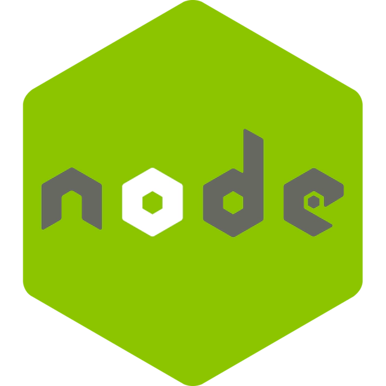

# Start Here

{ width=200 align=right }

Welcome to the JavaScript section of our knowledge base, where you'll find essential resources and insights related to JavaScript, Node.js, and React.js.

The goal is to equip you with the foundational knowledge needed to start your journey in Node.js and React.js, along with advanced topics to spark your curiosity. Whether you're just getting started or looking to expand your skills, you'll find valuable information here.

Feel free to explore the topics that interest you. If you encounter any issues or have new insights to share, you're welcome to open a pull request on GitHub. (1)
{ .annotate }

1. 

## Overview

### [Setting Up Your Development Environment](./setup/index.md)
Whether you're struggling with a new OS or just looking to optimize your setup, this section has something for everyone. We've packed it with tips, recommended tools, and step-by-step setup guides focused on JavaScript development.

### [JavaScript Basics and Beyond](./javascript/index.md)

New to JavaScript or not, it's always nice to revisit the basics. Here you will find everything you need to get comfortable with the language, from syntax and core concepts to useful functions and best practices, including version and package management. This section will set a strong foundation for your journey with Node.js and React.js.

### Introduction to Node.js
Under construction! :construction: Introduction to Node.js coming soon.

### Introduction to React.js
Under construction! :construction: Introduction to React.js coming soon.
