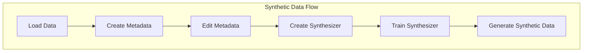

# Introduction

In this section we'll explore the generation of synthetic data using SDV library. The SDV offers multiple machine learning models ranging from classical statistical methods (Copulas) to deep learning methods (GANs). Synthetic Data is very important for a number of reasons:
- Software Testing
- Access Expansion
- Pilot New Products
- Augmented Data
- Plan scenarios

## Installation

To install we should use Poetry and Pyenv. The version of python should be >= 3.10 and < 3.11. For the analysis done on this library we used Python 3.10.9.
```
pyenv install 3.10.9
curl -sSL https://install.python-poetry.org | python3 -

# In this case we already had a project directory
poetry init
poetry env use ~/.pyenv/versions/3.10.9/bin/python
```

## Flow
Usually the flow of generating synthetic data is the following:


### Load Data
At first we need to load the data. If it stored in a csv format we can use the **[load_csvs](https://docs.sdv.dev/sdv/single-table-data/data-preparation/loading-data#load_csvs)** method. Otherwise since sdv uses a Pandas' dataframe we can use the Pandas' library to load the data.


```
from sdv.datasets.local import load_csvs

# assume that my_folder contains 1 CSV file named 'guests.csv'
datasets = load_csvs(folder_name='my_folder/')
```

```
import pandas as pd

data = pd.read_excel('file://localhost/path/to/table.xlsx')
```

### Create Metadata
Metadata is an object which contains the skeleton of our data, mainly types of columns, keys, etc.
On a second step we should create this metadata based on the data loaded previously. For this we have a method in sdv library called **[detect_from_dataframe](https://docs.sdv.dev/sdv/single-table-data/data-preparation/single-table-metadata-api#auto-detect-metadata)**. In this step is where we tell sdv whether we are trying to generate multitable or singletable metadata.
```
from sdv.metadata import SingleTableMetadata

metadata = SingleTableMetadata()
metadata.detect_from_dataframe(data=data)
```

### Edit Metadata
After this, a metadata object is created. It's strongly advised that this object should be checked and edited if need be. Usually the auto detection only gets the types and some may be wrong. For example, if a column flag has the values 0 or 1 it will say it is numerical even though the correct type is most probably boolean. To edit we should use the methods **[update_column](https://docs.sdv.dev/sdv/single-table-data/data-preparation/single-table-metadata-api#update_column)**, **[set_primary_key](https://docs.sdv.dev/sdv/single-table-data/data-preparation/single-table-metadata-api#set_primary_key)** and **[add_alternate_keys](https://docs.sdv.dev/sdv/single-table-data/data-preparation/single-table-metadata-api#add_alternate_keys)**.

For these methods we have a parameter called **[sdtype](https://docs.sdv.dev/sdv/reference/metadata-spec/sdtypes)** which sets the type of the column. These types are provided from the **[Faker Python Library](https://faker.readthedocs.io/en/master/providers.html)**.
The most common ones are the following:
- **Boolean**: Sdtype boolean describes columns that contain TRUE or FALSE values and may contain some missing data.
- **Categorical**: Sdtype categorical describes columns that contain distinct categories. The defining aspect of a categorical column is that only the values that appear in the real data are valid.
The categories may be ordered or unordered.
- **Datetime**: Sdtype datetime describes columns that indicate a point of time. This can be at any granularity: to the nearest day, minute, second or even nanosecond. Typically, the datetime will be represented as a string.
- **Numerical**: Sdtype numerical describes data with numbers. The defining aspect of numerical data is that there is an order and you can apply a variety of mathematical computations to the values (average, sum, etc.) The actual values may follow a specific format, such as being rounded to 2 decimal digits and remaining between min/max bounds.
- **ID**: Sdtype id describes columns that are used to identify rows (eg. as a primary or foreign key). ID columns do not have any other mathematical or special meanings. Typically, an ID column follows a particular structure, for example being exactly 8 digits long with a - in the middle. 

Also, note that this object can be **[saved or loaded locally](https://docs.sdv.dev/sdv/single-table-data/data-preparation/single-table-metadata-api#saving-and-loading-metadata)**.

```
metadata.update_column(
    column_name='room_type',
    sdtype='categorical')

metadata.set_primary_key(column_name='guest_email')

metadata.add_alternate_keys(column_names=['credit_card_number'])

metadata.save_to_json(filepath='my_metadata_v1.json')

# Needs to import SingleTableMetadata
metadata_obj = SingleTableMetadata.load_from_dict(metadata_dict)
```

### Create Synthesizer
The synthesizer is the tool that uses machine learning to understand your data and create synthetic data based on it.
There are several different models of synthesizers.
For single tables we have:
- [GaussianCopulaSynthesizer](https://docs.sdv.dev/sdv/single-table-data/modeling/synthesizers/gaussiancopulasynthesizer)
  - [Fast ML Preset](https://docs.sdv.dev/sdv/single-table-data/modeling/synthesizers/fast-ml-preset) which is a preset that uses the GaussianCopulaSynthesizer in background.
- [CTGANSynthesizer](https://docs.sdv.dev/sdv/single-table-data/modeling/synthesizers/ctgansynthesizer)
- [TVAESynthesizer](https://docs.sdv.dev/sdv/single-table-data/modeling/synthesizers/tvaesynthesizer)
- [CopulaGANSynthesizer](https://docs.sdv.dev/sdv/single-table-data/modeling/synthesizers/copulagansynthesizer)

For multi tables we have:
- [HMASynthesizer](https://docs.sdv.dev/sdv/multi-table-data/modeling/synthesizers/hmasynthesizer)
  (note that we can set the synthesizer used for each table on a multitable synthesizer)


```
from sdv.single_table import GaussianCopulaSynthesizer

synthesizer = GaussianCouplaSynthesizer(metadata)
```

### Train Synthesizer
To train the synthesizer we use the method **fit**.
```
synthesizer.fit(real_data)
```
You can also **[save and load the synthesizer](https://docs.sdv.dev/sdv/single-table-data/modeling/synthesizers/fast-ml-preset#saving-your-synthesizer)**.

### Generate Synthetic Data
To generate synthetic data with our synthesizer we should use the method **[sample](https://docs.sdv.dev/sdv/single-table-data/sampling/sample-realistic-data#sample)**.
```
synthetic_data = synthesizer.sample(num_rows=100)
```
It's also possible to generate conditional synthetic data.
```
from sdv.sampling import Condition

suite_guests_with_rewards = Condition(
    num_rows=250,
    column_values={'room_type': 'SUITE', 'has_rewards': True}
)

suite_guests_without_rewards = Condition(
    num_rows=250,
    column_values={'room_type': 'SUITE', 'has_rewards': False}
)

synthetic_data = custom_synthesizer.sample_from_conditions(
    conditions=[suite_guests_with_rewards, suite_guests_without_rewards],
    output_file_path='synthetic_simulated_scenario.csv'
)
```

Now that we know the flow of usage of the sdv library, it's important to mention that all of these steps have more options to them not shown here. For those you can check the **[official documentation](https://docs.sdv.dev/sdv/)**.

## Evaluation
One other tool that the sdv library provides is an **[evaluation module](https://docs.sdv.dev/sdv/single-table-data/evaluation)** which we can use to compare the newly synthetic data with the real data. This is very helpful in order to check the quality of our synthetic data and decide whether to use it or not.

## Metrics

| Synthesizer model | Method | Num of rows used/generated | Time |
| ----------- | ----------- | ----------- | ----------- |
| Gaussian - FastML | fit | 5000 | 0.1s |
| Gaussian - FastML | sample | 100000 | 0.9s |
| Gaussian - FastML | sample | 1000000 | 8.0s |
| Gaussian  | fit | 5000 | 1.2s |
| Gaussian  | sample | 100000 | 1.9s |
| Gaussian  | sample | 1000000 | 17.4s |
| CTGAN  | fit | 5000 | 1min 21s |
| CTGAN  | sample | 100000 | 2.3s |
| CTGAN  | sample | 1000000 | 22.1s |
| TVAE  | fit | 5000 | 28.1s |
| TVAE  | sample | 100000 | 1.3s |
| TVAE  | sample | 1000000 | 13s |
| CopulaGAN  | fit | 5000 | 1min 31s |
| CopulaGAN  | sample | 100000 | 2.8s |
| CopulaGAN  | sample | 1000000 | 28.3s |


## Conclusion
There are now 2 notebooks available that test the single table and multi table usage of the sdv library.