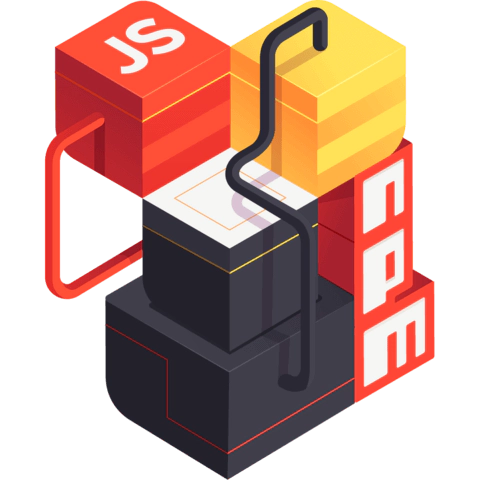

# Chapter II

## Managing packages and versions

When working with any JavaScript web application, theres at least two important things you will need to setup:

  - a __Node.js environment__
  - a __package manager__ (yarn, npm, etc.)


## Node Version Manager

{ width=200 align=right }

During your journey with React.js, you will probably work on many projects that use different versions and environments of Node.js. That is where a version manager comes in handy.

For example, a tool like Node Version Manager (NVM), allows you to download any of the remote Long Term Support (LTS) versions of Node.js with a simple command; to easily switch between multiple versions of Node.js, right from the command line, and set up aliases to switch between different downloaded versions of Node.js with ease. This switching can even be done automatically by setting up some scripts on your command line tools!

All the information regarding the aforementioned features is available on the NVM official documentation, here: [Node Version Manager (NVM)](https://github.com/nvm-sh/nvm){ target=_blank }.

### Installation

#### Remove existing versions

First, remove existing Node.js versions with the following commands (this is needed to avoid version conflicts later on).
If this is your first time using Node.js and you don't have any versions installed yet you can just skip this step.

```
brew uninstall --ignore-dependencies node
brew uninstall --force node
```

#### Install NVM

Follow the [official NVM documentation](https://github.com/nvm-sh/nvm#installing-and-updating){ target=_blank } to find the most recent and up-to-date way to install NVM on your machine.

#### Installing a Node.js version with NVM

First of all, see which Node versions are available to install. To see available versions, type:

```
nvm ls-remote
```

Now, you can install any version listed in the above output. You can also use aliases names like `node` for latest version, `lts` for latest LTS version, etc.

```
nvm install node     # Installing latest version
nvm install 18       # Installing Node.js 18.X version
```

After installing, you can verify your locally available versions with the following command:

```
nvm ls
```

If you have multiple versions installed, you can set any of those versions as the default one, at any time. For example, to set the node 18.X as the default version, type the following:

```
nvm alias default 18
```

To switch between versions, use the command:

```
nvm use 18
```

### Alternatives

If you have restrictions on which node version manager tool to use, there are other alternatives, that you can find below!

  - [Nodenv](https://github.com/nodenv/nodenv){ target=_blank }
  - [ASDF](https://asdf-vm.com/){ target=_blank }
  - [N](https://github.com/tj/n){ target=_blank }


## Node Package Manager

{ width=200 align=right }

Once you start working on a new JavaScript web application project, you will be required to install certain package dependencies, which are like Ruby gems, but for JS.

There are a few tools that facilitate this work, such as [Node Package Manager (NPM)](https://www.npmjs.com/). When installing a node version on your system, it usually already includes a working version of NPM that you can use!

Essentially, NPM consists of two important components: a __Command Line Interface (CLI)__ to interact with NPM via the terminal, and a __[registry](https://www.npmjs.com/){ target=_blank }__ that you can access, containing an extensive public database of JavaScript packages. You can even publish your own packages there!

### Installation

As previously mentioned, NPM itself usually does not need to be installed, since it is provided by default by your node version manager installation. We do not recommend installing NPM manually!

Furthermore, to install any package using NPM you can first search for it on their website, then follow the instructions provided by the package author.
For example, if you want to install the [React](https://www.npmjs.com/package/react){ target=_blank } package, you can open the previous link and follow the installation guide.

In general, you can run the following commands to install any package:

```
npm install <package name>
```

You may also uninstall a package, simply by calling the npm uninstall command followed by the package name.

```
npm uninstall <package name>
```

### Alternatives

{ width=200 align=right }

Apart from NPM, there is another very popular alternative for a package manager, called __Yarn__. You can read more about it by clicking the link below:

  - [Yarn](https://yarnpkg.com/)
