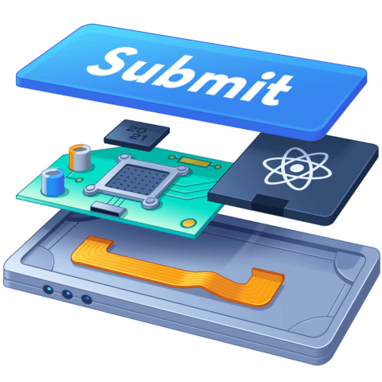

# Building your own app

{ width=200 align=right }

Assuming you've read everything else beforehand (or if you're already comfortable with React), then the next steps for you should be the creation of a React app to communicate with an external API, in this case [Spotify's API](https://developer.spotify.com/documentation/web-api){ target=_blank}.

Please follow the link above to get started on how to use and set up their API when building your local web app.

In terms of requisites for this app you will be building, these are the tasks we want you to complete:

_(each task's estimated duration is within brackets and color coded in terms of difficulty)_

* Start up your React app project locally using Vite <b style="color:#00b1ee">_(1-2 hours)_</b>
* A __single public access page__, with a button to log in to a Spotify account <b style="color:#ff3f33">_(4-8 hours)_</b>
* Once logging in, show a top banner with:
    * a __search bar__ that allows searching for artists, albums and/or tracks, and shows the results of the search on a dropdown container with links to each <b style="color:#eebf00">_(3-6 hours)_</b>
    * the __current user's avatar, name and a logout button__ <b style="color:#00b1ee">_(&lt;1 hour)_</b>
* Several pages protected by authentication, for the following:
    * a __Home__ page, showing the "top 5 artists" and "top 5 tracks" with links to each <b style="color:#00b1ee">_(1-2 hours)_</b>
    * a __dynamic page for each artist__, containing the artist's albums and top tracks, with links to each of them <b style="color:#00b1ee">_(&lt;1 hour)_</b>
    * a __dynamic page for each album__, containing information and links to all tracks <b style="color:#00b1ee">_(&lt;1 hour)_</b>
    * a __dynamic page for each track__, showing some basic information (i.e. name, image, release date, artist name, album name, track duration and popularity) <b style="color:#00b1ee">_(&lt;1 hour)_</b>

If you have any doubts on how to implement some of these pages, we suggest reading back on how to use __React Router__, perform __Authentication__ and the basics of __state management in React__!

As you complete each task, feel free to publish your code on a public repository (i.e. on Github), so that we can guide you and evaluate your work.

Happy coding!
